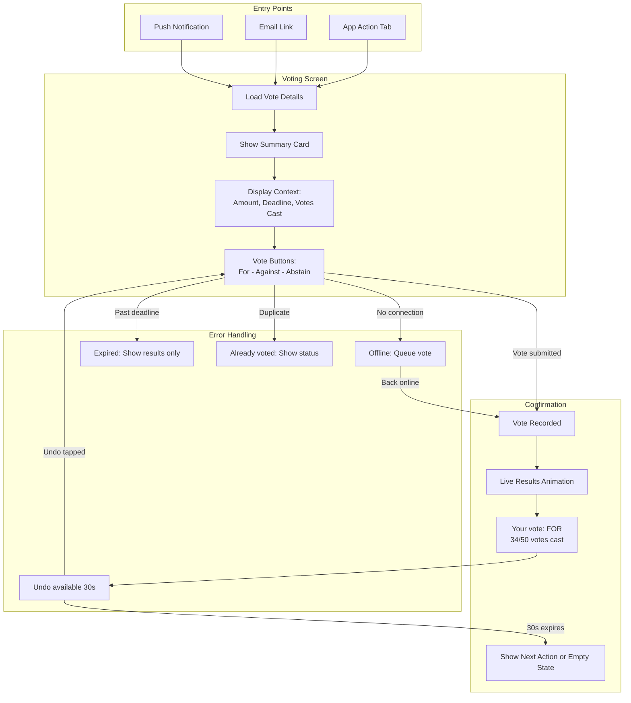
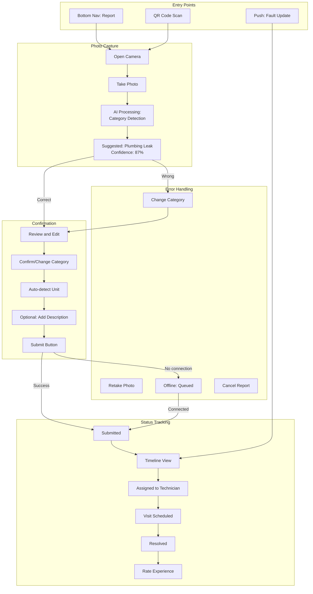
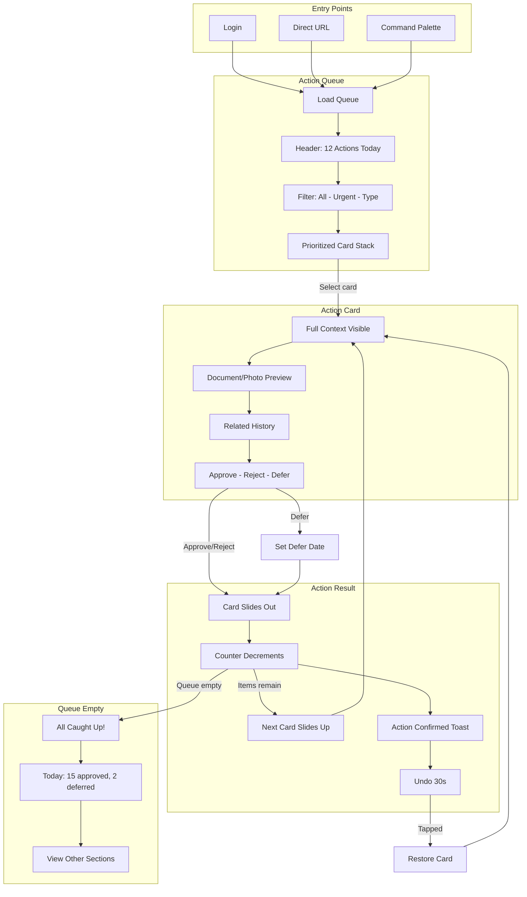
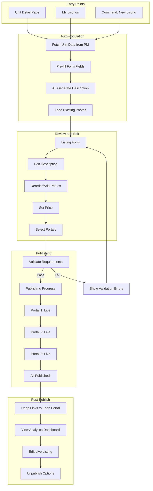
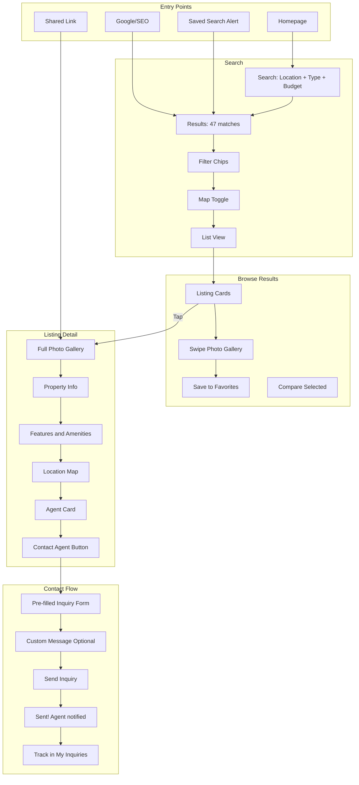

# UX Design Specification - Property Management System (PPT) & Reality Portal

**Author:** Martin Janci
**Date:** 2025-12-20

---

<!-- UX design content will be appended sequentially through collaborative workflow steps -->

## Executive Summary

### Project Vision

Property Management System (PPT) and Reality Portal represent a unified PropTech ecosystem designed to transform how Central European properties are managed and transacted. The UX vision centers on **eliminating fragmentation** - giving every user a single, intelligent interface for their property-related needs, whether they're managing a building, living in an apartment, or selling real estate.

**Core UX Principle:** One platform, multiple experiences - unified design language adapted to role, context, and device.

### Target Users

| User Type | Primary Context | Key UX Needs |
|-----------|-----------------|--------------|
| **Property Managers** | Desktop-first, multitasking | Dense dashboards, keyboard shortcuts, batch actions |
| **Owners** | Mobile-first, occasional use | Transparency, simplicity, remote participation |
| **Tenants** | Mobile-only, reactive use | Minimal friction, instant feedback, photo-first |
| **Realtors** | Multi-device, time-pressured | Speed, multi-portal sync, professional presentation |
| **Portal Users** | Mobile-heavy, browsing | Discovery, comparison, quick contact |

**Accessibility Priority:** Elderly owners (significant user segment) require high-contrast themes, large touch targets (48px+), and simplified cognitive load.

### Key Design Challenges

1. **Technical Ability Spectrum**: Designing for 58-year-old retirees AND 29-year-old digital natives simultaneously
2. **Multi-Platform Coherence**: Consistent UX across React SPA, Next.js SSR, React Native, and Kotlin Multiplatform
3. **Information Density Scaling**: Same data, different complexity levels per role
4. **Offline-First Mobile**: Graceful degradation and sync for areas with poor connectivity
5. **WCAG 2.1 AA Compliance**: Accessibility as a business requirement, not afterthought

### Design Opportunities

1. **AI-Enhanced Simplicity**: Use AI to reduce user effort (OCR readings, smart categorization, predictive suggestions)
2. **Role-Adaptive UI**: Progressive disclosure that matches user expertise and permissions
3. **Fusion UX**: Seamless property-to-listing transition that feels magical
4. **Mobile-Native Communication**: Push notifications, QR onboarding, photo-first interactions

### First Principles UX Approach

**Core Philosophy:** Design for tasks and outcomes, not roles and data.

**Guiding Principles:**

1. **Action-Centric Design**: Show users what they can DO, not what they can SEE
2. **Re-learnability First**: Optimize for monthly visitors, not daily power users
3. **Invisible AI**: AI should reduce effort without requiring trust decisions
4. **Task Flows Over Dashboards**: Direct paths to outcomes, minimal navigation
5. **Channel Flexibility**: Users choose how to be reached, not the system

**Design Implications:**

| Traditional Approach | First Principles Approach |
|---------------------|---------------------------|
| Role-based dashboards | Task-based action queues |
| Data-heavy screens | Outcome-focused interfaces |
| Feature-rich menus | "What can I do?" clarity |
| Push notification defaults | User-controlled channels |
| AI suggestions to approve | AI actions to confirm or correct |

**Fundamental User Needs (Rebuilt from First Principles):**

| User | What They Really Need |
|------|----------------------|
| **Manager (Eva)** | "Tell me what needs my attention and let me act on it" |
| **Owner (Ján)** | "Show me my money and let me participate in decisions" |
| **Tenant (Michaela)** | "Fix my problem with minimum effort from me" |
| **Realtor (Martin)** | "Get my listing live everywhere in seconds" |
| **Portal User** | "Help me find a home that matches my life" |

### What If Scenario Insights

Through exploring alternative UX approaches, we discovered:

**Design Principles Validated:**

1. **Mobile-Viable Screens**: Every screen must degrade gracefully to mobile
2. **Design for Ján, Delight Michaela**: Accessibility-first benefits all users
3. **Notification-Driven Entry**: Primary UX entry is push/email deep links, menu is fallback
4. **AI for Grunt Work**: Automate data input and routing, humans own decisions
5. **Contextual Visual Identity**: PM and Reality Portal can have different visual themes while sharing a design system

**Critical Reframe:**
- Navigation menus are a fallback, not the primary UX
- Batch operations may be unnecessary if individual actions are fast enough
- Brand consistency matters less than context-appropriate experience

### Cross-Functional Technical Constraints

**Design System Architecture:**
- Token-first approach: shared design tokens (colors, spacing, typography) across all platforms
- Platform-specific component implementations (React, React Native, Compose/SwiftUI)
- Consistent interaction patterns documented, adapted per platform

**Offline Strategy:**
- PM mobile (React Native): Full offline with sync queue
- Reality mobile (KMP): Read-only cached content
- Web apps: Graceful degradation, no true offline

**Rendering Strategy:**
- ppt-web: React SPA, full client-side
- reality-web: Next.js SSR for listings, client components for interactivity
- Hydration states required for SSR pages

**Real-time & Notifications:**
- WebSocket for in-app real-time updates
- Push notifications with cross-device deduplication
- User-controlled notification preferences
- Email as fallback/digest option

**Key UX Implications:**
1. Action cards must be self-contained (decide without drilling down)
2. Offline pending states need explicit "will sync" messaging
3. SSR pages need loading states for interactive elements
4. Buttons always visible; gestures as accelerators only

### User Pain Points (from Customer Support Theater)

**Critical UX Failures to Prevent:**

1. **Hidden Navigation**
   - Problem: Users can't find features they know exist
   - Fix: Bottom nav with labels, deep-linked notifications

2. **Irreversible High-Stakes Actions**
   - Problem: Easy to make expensive mistakes
   - Fix: Confirmation for high-value actions, 30-second undo window

3. **Status Black Holes**
   - Problem: Users submit something and hear nothing
   - Fix: Visible timeline, expected response times, escalation paths

4. **Silent System Actions**
   - Problem: System unpublishes/pauses content without notification
   - Fix: Always notify when system affects user content

5. **Admin Diagnostic Gaps**
   - Problem: Can't find specific problems in large datasets
   - Fix: Search by ID, health indicators, issue filters

**UX Principles from Support Complaints:**

| Principle | Implementation |
|-----------|----------------|
| Notification-driven entry | Push deep-links directly to action |
| Reversible actions | Undo window + confirmation thresholds |
| Visible progress | Timeline showing next expected step |
| No silent failures | User notified of all system actions |
| Diagnostic admin UX | ID search, health indicators, issue filters |

### User Persona Focus Group Insights

**Validated UX Principles:**
- Action-centric design works for occasional users (Ján, Michaela)
- Notification deep-links valued by all
- AI with human confirmation, never silent automation
- Offline mode essential for site visits and poor connectivity

**Refined UX Principles:**

| Original Principle | Refinement |
|-------------------|------------|
| Action-centric only | Action-first, dashboard available (power users need overview) |
| Accessibility default | Accessible default + "Compact mode" option for power users |
| Push as primary entry | Push for mobile, real-time in-app for desktop power users |
| AI for grunt work | AI with confidence thresholds (high → auto, low → review) |

**New UX Requirements from Focus Group:**

1. **Summary counts alongside actions** - Eva needs "12 open faults" context
2. **View-only modes** - Ján wants to "just check balance" without actions
3. **Granular notification preferences** - Martin needs per-category control
4. **Slack/email integration for admins** - Lucia prefers ops channels
5. **Explicit offline education** - "Saved on phone, will send when online"
6. **Sync completion confirmation** - Trust requires explicit feedback
7. **AI content suggestions** - Martin wants listing description drafts

## Core User Experience

### Defining Experience

**Core Actions by System:**

| System | Core Action | Success Metric |
|--------|-------------|----------------|
| **PM Mobile (Owners/Tenants)** | Notification → Action → Confirmation | < 60 seconds end-to-end |
| **PM Desktop (Managers)** | Prioritized queue → Act without drilling down → Next | 50% reduction in task time |
| **Reality Portal** | Search → Browse → Inquiry | < 3 clicks to contact agent |

**The Effortless Promise:** Any action that currently takes 10+ steps should take 3 or fewer.

### Platform Strategy

| Platform | Technology | Rendering | Offline | Primary Entry |
|----------|------------|-----------|---------|---------------|
| ppt-web | React SPA | Client | Graceful degradation | Direct URL, bookmarks |
| mobile | React Native | Native | Full with sync queue | Push notifications |
| reality-web | Next.js | SSR/SSG | None | Search engines, links |
| mobile-native | Kotlin MP | Native | Read cache | App store, deep links |

**Token-First Design System:**
- Shared: Colors, typography, spacing, shadows, border-radius
- Platform-specific: Components, interactions, navigation patterns

### Effortless Interactions

**AI-Assisted Flows:**

| Flow | Traditional | Effortless |
|------|-------------|------------|
| Meter reading | Type value manually | Photo → OCR → Confirm |
| Fault report | Fill 8-field form | Photo → AI categorize → Confirm |
| Voting | Navigate → Read → Find button → Vote | Push → Single screen → Vote |
| Listing creation | Enter 20+ fields | Auto-populate from unit → Edit → Publish |

**Automation Boundaries:**
- ✅ Automate: Data extraction, categorization, routing, syncing
- ⚠️ Human confirms: Values, categories, high-value actions
- ❌ Never automate: Voting, payments, account deletion

### Critical Success Moments

**First-Time User Journeys:**

| User | Success Path | "Aha!" Moment |
|------|--------------|---------------|
| Owner (Ján) | Open app → See balance → Vote on something | "I voted from my couch!" |
| Tenant (Michaela) | QR scan → Photo fault → See confirmation | "That was... easy?" |
| Manager (Eva) | See queue → Approve item → It disappears | "This is going to save me hours" |
| Realtor (Martin) | Click "List" → Auto-filled data → Published | "It's already on 3 portals!" |

**Failure Prevention:**
- No action without confirmation feedback
- No status without timeline
- No error without recovery path
- No system action without user notification

### Experience Principles

1. **Action-First, Dashboard-Available** - Lead with tasks, not data
2. **60-Second Tasks** - Notification to completion in under a minute
3. **Confirm, Not Assume** - AI assists, user approves
4. **No Status Black Holes** - Every item shows next expected step
5. **Reversible by Default** - Undo window, confirmation for high-stakes
6. **Design for Ján, Delight Michaela** - Accessible first, density optional
7. **Notification IS Navigation** - Deep-links replace menu hunting
8. **Platform-Native, Token-Unified** - Consistent language, native feel

## Desired Emotional Response

### Primary Emotional Goals

| User Type | Primary Emotion | Secondary Emotions |
|-----------|-----------------|-------------------|
| Property Manager (Eva) | **In Control** | Efficient, Accomplished, Calm |
| Owner (Ján) | **Informed & Included** | Respected, Confident, Valued |
| Tenant (Michaela) | **Heard & Confident** | Relieved, Trusting |
| Realtor (Martin) | **Efficient & Professional** | Impressed, Proud |
| Portal User | **Excited & Hopeful** | Curious, Motivated |

**Unifying Promise:** "This just works. I don't have to think about it."

### Emotional Journey Mapping

| Stage | Emotion Goal | Design Triggers |
|-------|--------------|-----------------|
| **Discovery** | "This understands me" | Immediate value, no empty states |
| **First Action** | "This is easy" | Guided flow, obvious next step |
| **Core Use** | "I'm accomplishing things" | Progress indicators, shrinking queues |
| **Completion** | "That was satisfying" | Confirmation, subtle celebration |
| **Error/Problem** | "I can fix this" | Clear recovery path, undo available |
| **Return** | "Right where I left off" | Persistent state, relevant notifications |

### Micro-Emotions

**Design For:**
- ✅ Confidence over Confusion
- ✅ Trust over Skepticism
- ✅ Accomplishment over Frustration
- ✅ Calm over Anxiety
- ✅ Delight over Mere Satisfaction

**Actively Prevent:**
- ❌ Confusion (hidden features) → Visible navigation
- ❌ Anxiety (unclear if worked) → Always confirm
- ❌ Distrust (AI black box) → Show reasoning
- ❌ Abandonment (no response) → Timeline visibility
- ❌ Frustration (irreversible) → Undo windows

### Emotional Design Implications

| Emotion | Design Approach |
|---------|-----------------|
| In Control | Action queues with counts, priority badges |
| Informed | Transparent financials, plain-language summaries |
| Heard | Instant confirmation, visible timelines |
| Efficient | Pre-filled forms, one-click actions |
| Confident | AI shows confidence %, easy corrections |
| Calm | Neutral palette, reserved use of red |

### Emotional Design Principles

1. **Confirmation is Reassurance** - Every action gets feedback
2. **Progress is Visible** - Timelines, sync status, counts
3. **AI is Transparent** - Confidence scores, reasoning shown
4. **Errors are Recoverable** - Undo windows, fix buttons
5. **Celebration is Earned** - Subtle animations, not overwhelming
6. **Calm is the Baseline** - Neutral tones, red for emergencies only
7. **Trust Through Honesty** - Realistic timelines, no false promises

## UX Pattern Analysis & Inspiration

### Inspiring Products Analysis

**1. Notion (For Property Managers - Eva)**
| Aspect | Analysis |
|--------|----------|
| **Core Strength** | Information density without overwhelming - nested pages, toggle sections, configurable views |
| **Onboarding** | Progressive disclosure - starts simple, reveals power as needed |
| **Navigation** | Sidebar + command palette (⌘K) - works for both mouse and keyboard power users |
| **Delight** | Database views (table, board, calendar) from same data - users choose their lens |
| **Key Lesson** | Same data, multiple consumption modes - adapt to user preference, not force single view |

**2. Splitwise (For Owners/Tenants - Ján & Michaela)**
| Aspect | Analysis |
|--------|----------|
| **Core Strength** | Complex finances made dead simple - "you owe €47" is the entire summary |
| **Onboarding** | Photo receipt scanning, minimal form fields, smart categorization |
| **Navigation** | Bottom nav with 5 clear icons, no hamburger menus |
| **Error Handling** | Easy "undo" for accidental entries, clear correction flows |
| **Key Lesson** | Financial transparency through simplification - hide complexity, show outcomes |

**3. Airbnb (For Reality Portal Users & Realtors - Martin)**
| Aspect | Analysis |
|--------|----------|
| **Core Strength** | Photo-first listings, search that "just works", comparison is effortless |
| **Onboarding** | Skip-able onboarding, immediate value (browse before login) |
| **Navigation** | Map + list hybrid, filters that persist intelligently |
| **Visual Design** | Full-bleed photos, clear pricing, trust indicators (reviews, verification) |
| **Key Lesson** | Discovery should be visual and emotional, not data-driven grids |

**4. Revolut (For Financial Features - All Users)**
| Aspect | Analysis |
|--------|----------|
| **Core Strength** | Real-time updates, push notifications that deep-link to exact context |
| **Onboarding** | Face ID setup, immediate card in Apple Wallet |
| **Error Handling** | "Insufficient funds" with immediate fix path (top-up button) |
| **Key Lesson** | Notifications as navigation - every push leads to actionable screen |

**5. WhatsApp (For Communication Features - Managers & Tenants)**
| Aspect | Analysis |
|--------|----------|
| **Core Strength** | Read receipts, presence indicators, zero learning curve |
| **Offline** | Graceful offline with "waiting to send" indicators, auto-sync |
| **Key Lesson** | Trust through transparency - show exactly what happened and what's pending |

### Transferable UX Patterns

**Navigation Patterns:**
| Pattern | Source App | Applies To |
|---------|-----------|------------|
| **Command Palette (⌘K)** | Notion, Slack | ppt-web managers - fast access to any action |
| **Bottom Nav + Labels** | Splitwise, Revolut | Mobile apps - visible, accessible navigation |
| **Map + List Hybrid** | Airbnb, Zillow | Reality Portal - visual discovery with data |
| **Deep-Linked Notifications** | Revolut | All mobile - primary entry point to actions |

**Interaction Patterns:**
| Pattern | Source App | Applies To |
|---------|-----------|------------|
| **Photo-First Input** | Splitwise, Airbnb | Meter readings (OCR), fault reports, listings |
| **Progressive Disclosure** | Notion | Manager dashboard - density on demand |
| **Pull-to-Refresh with Status** | iOS Mail, Banking Apps | Offline sync confirmation |
| **Swipe Actions with Undo** | iOS Mail, Todoist | Quick actions on action queues |
| **Inline Approval** | Slack, GitHub | Vote/approve without drilling down |

**Visual Patterns:**
| Pattern | Source App | Applies To |
|---------|-----------|------------|
| **Full-Bleed Hero Photos** | Airbnb | Reality Portal listings |
| **Financial Summary Cards** | Revolut, Splitwise | Owner balance overview |
| **Status Pills/Badges** | Notion, Linear | Fault status, voting status |
| **Timeline Views** | GitHub, Jira | Request progress visibility |
| **Confidence Indicators** | Grammarly | AI OCR readings, AI categorization |

**Trust & Transparency Patterns:**
| Pattern | Source App | Applies To |
|---------|-----------|------------|
| **Read Receipts** | WhatsApp | Message delivery confirmation |
| **"Pending Sync" Indicators** | Gmail Offline | Offline action queuing |
| **Undo Windows** | Gmail | High-stakes action protection |
| **Processing Progress** | Banking Apps | Long-running operations visibility |

### Anti-Patterns to Avoid

**❌ Navigation Anti-Patterns:**
| Anti-Pattern | Why to Avoid | Better Alternative |
|--------------|--------------|-------------------|
| **Hamburger Menu as Primary Nav** | Hidden = forgotten, especially for elderly users (Ján) | Visible bottom nav with labels |
| **Nested Settings Mazes** | Users can't find features they know exist | Searchable settings + smart defaults |
| **Infinite Scrolling Without Position** | Lost context, no "where am I" | Pagination or sticky headers with counts |

**❌ Interaction Anti-Patterns:**
| Anti-Pattern | Why to Avoid | Better Alternative |
|--------------|--------------|-------------------|
| **Swipe-Only Actions (No Buttons)** | Invisible affordances, accessibility fail | Buttons visible; swipe as accelerator |
| **Auto-Dismiss Confirmations** | Users miss critical info | User-dismissed or sticky until action |
| **Silent Background Sync** | Users don't know if action succeeded | Explicit sync status with confirmation |

**❌ Visual Anti-Patterns:**
| Anti-Pattern | Why to Avoid | Better Alternative |
|--------------|--------------|-------------------|
| **Red for Everything Important** | Alarm fatigue, anxiety-inducing | Red = errors only; blue/green for actions |
| **Data Tables on Mobile** | Horizontal scroll hell | Cards or expandable rows |
| **Tiny Touch Targets** | Fails elderly users, accessibility | 48px minimum, generous padding |

**❌ Trust Anti-Patterns:**
| Anti-Pattern | Why to Avoid | Better Alternative |
|--------------|--------------|-------------------|
| **AI Black Box Decisions** | Users don't trust what they don't understand | Show confidence %, allow corrections |
| **"Your Request Has Been Submitted"** | Status black hole begins | Timeline with next expected step |
| **System Actions Without Notification** | Users feel out of control | Always notify when system affects user content |

### Design Inspiration Strategy

**What to Adopt Directly:**
| Pattern | Why Adopt | Implementation |
|---------|-----------|----------------|
| **Deep-Linked Push Notifications** | Aligns with "Notification IS Navigation" principle | Every push lands on actionable screen |
| **Photo-First Data Entry** | Supports "Effortless Interactions" for tenants | Camera → OCR → Confirm flow |
| **Financial Summary Cards** | Matches Ján's "Show me my money" need | Balance + trend at glance |
| **Timeline Progress Views** | Prevents "Status Black Holes" | Every item shows next step |
| **Undo Windows (30 seconds)** | Reversible by Default principle | High-stakes action protection |

**What to Adapt:**
| Pattern | Original | Our Adaptation |
|---------|----------|----------------|
| **Notion's View Switcher** | Power user feature | Simplified: "Compact" vs "Comfortable" toggle |
| **Airbnb's Map+List** | Search-centric | Location as filter, list as default |
| **Revolut's Real-Time Feed** | Transaction-focused | Action queue with priority sorting |
| **Splitwise's Receipt OCR** | Expense splitting | Meter reading + fault categorization |

**What to Avoid:**
| Anti-Pattern | Why Avoid | Our Approach Instead |
|--------------|-----------|---------------------|
| Airbnb's complex filters | Too many options overwhelm occasional users | Smart defaults + "More filters" expandable |
| Notion's steep learning curve | Our users are monthly visitors, not daily | Prioritize re-learnability |
| Revolut's data density | Works for financial natives, not elderly owners | Spacious layouts, large text option |

**Inspiration Principles:**
1. **Steal Outcomes, Not Aesthetics** - Airbnb's trust comes from reviews, not just photos
2. **Context Over Copy** - Revolut patterns work for daily users; adapt for monthly users
3. **Accessibility Multiplies Value** - Patterns that work for Ján (65+) delight Michaela (29)
4. **Notification-First Design** - Build screens for deep-link entry, not menu navigation

## Design System Foundation

### Design System Choice

**Recommended: Token-First Themeable System with Platform-Native Components**

| Component | Technology Choice | Rationale |
|-----------|------------------|-----------|
| **Design Tokens** | Style Dictionary | Cross-platform token generation (CSS, React Native, Kotlin, Swift) |
| **ppt-web (React SPA)** | Radix UI + Tailwind CSS | Accessible primitives, utility-first styling, headless components |
| **reality-web (Next.js)** | Radix UI + Tailwind CSS | Same as ppt-web for consistency, SSR-compatible |
| **mobile (React Native)** | React Native Paper + Custom Components | Material-inspired with token-based theming |
| **mobile-native (KMP)** | Platform-native (Compose/SwiftUI) | Maximum native feel, shared Kotlin business logic |

### Rationale for Selection

**Why Not Pure Custom Design System:**
| Factor | Analysis |
|--------|----------|
| **Timeline** | PropTech market timing matters; custom system delays MVP by 3-6 months |
| **Team Resources** | Focus on domain features, not reinventing buttons and modals |
| **Maintenance** | Accessibility updates, browser compatibility handled by library maintainers |

**Why Not Pure Material/Ant Design:**
| Factor | Analysis |
|--------|----------|
| **Brand Identity** | PM and Reality Portal need distinct visual identities |
| **User Context** | Central European aesthetic expectations differ from generic enterprise |
| **Elderly Accessibility** | Need control over spacing, font sizes beyond standard system |

**Why Radix + Tailwind:**
| Factor | Analysis |
|--------|----------|
| **Accessibility** | Radix primitives are WCAG 2.1 AA compliant by default |
| **Flexibility** | Headless = full visual control, no "MUI look" |
| **Performance** | Tailwind tree-shakes unused CSS; Radix has small bundle |
| **SSR Compatibility** | Works with Next.js hydration for reality-web |
| **Theming** | CSS custom properties align with our token-first approach |

**Why Platform-Native for KMP Mobile:**
| Factor | Analysis |
|--------|----------|
| **Elderly Users (Ján)** | Native gestures, system fonts, familiar patterns reduce learning |
| **Performance** | Compose/SwiftUI outperform cross-platform for animations |
| **OS Integration** | Native push, biometrics, offline storage work seamlessly |

### Implementation Approach

**Token Architecture:**

```
design-tokens/
├── tokens/
│   ├── color.json          # Semantic colors (primary, surface, error)
│   ├── typography.json     # Font families, sizes, weights
│   ├── spacing.json        # 4px grid system
│   ├── radius.json         # Border radii
│   └── shadow.json         # Elevation system
├── themes/
│   ├── pm-light.json       # Property Management light theme
│   ├── pm-dark.json        # Property Management dark theme
│   ├── reality-light.json  # Reality Portal light theme
│   └── reality-dark.json   # Reality Portal dark theme
└── platforms/
    ├── web/                # CSS custom properties output
    ├── react-native/       # JavaScript constants
    ├── android/            # Kotlin values
    └── ios/                # Swift values
```

**Component Strategy:**

| Layer | Approach |
|-------|----------|
| **Primitives (Radix)** | Use headless: Dialog, Dropdown, Tooltip, Tabs, Toast |
| **Styled Primitives** | Tailwind + tokens: Button, Input, Card, Badge, Avatar |
| **Composite Components** | Custom: ActionCard, FinancialSummary, StatusTimeline |
| **Page Templates** | Custom: ActionQueue, ListingCard, PropertyDetail |

**Accessibility Layer:**

| Feature | Implementation |
|---------|----------------|
| **Focus Management** | Radix's built-in focus trap and return focus |
| **Keyboard Navigation** | Radix provides full keyboard support |
| **Screen Readers** | Semantic HTML from Radix primitives |
| **High Contrast** | Token-based theme switch (WCAG AAA contrast option) |
| **Large Text Mode** | Typography token override (150% scale) |
| **Reduced Motion** | CSS prefers-reduced-motion media query respected |

### Customization Strategy

**Visual Identity Differentiation:**

| System | Visual Direction | Token Overrides |
|--------|-----------------|-----------------|
| **Property Management** | Professional, calm, trustworthy | Blues, generous spacing, muted accents |
| **Reality Portal** | Aspirational, photo-first, modern | Warm neutrals, tighter spacing, lifestyle imagery |

**Brand Token Example:**

```json
{
  "pm": {
    "color": {
      "primary": { "value": "#2563EB" },
      "surface": { "value": "#F8FAFC" },
      "accent": { "value": "#0891B2" }
    }
  },
  "reality": {
    "color": {
      "primary": { "value": "#0F172A" },
      "surface": { "value": "#FFFFFF" },
      "accent": { "value": "#F97316" }
    }
  }
}
```

**Component Customization Rules:**

| Rule | Application |
|------|-------------|
| **Spacing** | Always use tokens: `gap-{token}`, never arbitrary values |
| **Colors** | Never use raw hex; always semantic: `bg-surface`, `text-primary` |
| **Typography** | Only approved type scale; body/heading/label/caption |
| **Borders** | Consistent radii: `rounded-sm` (4px), `rounded-md` (8px), `rounded-lg` (16px) |
| **Shadows** | Three levels only: `shadow-sm`, `shadow-md`, `shadow-lg` |

**Platform Adaptation:**

| Platform | Adaptations |
|----------|-------------|
| **Web** | Hover states, click actions, keyboard shortcuts |
| **Mobile (RN)** | Touch targets 48px+, swipe gestures, haptic feedback |
| **Native (KMP)** | System fonts, native transitions, platform conventions |

## Defining User Experiences

### Defining Experiences by System

Every successful product has a defining experience - the core interaction that, if we nail it, everything else follows.

**Property Management System:**

| User | Defining Experience | "Friends Description" |
|------|--------------------|-----------------------|
| **Owner (Ján)** | "Open notification → See what's needed → Vote/Approve → Done" | "I voted on the new roof from my couch in 30 seconds" |
| **Tenant (Michaela)** | "Photo → Submit → Track → Fixed" | "I took a photo of the leak and they fixed it without me calling anyone" |
| **Manager (Eva)** | "See queue → Act inline → Item disappears → Next" | "My inbox used to take hours, now it's empty by lunch" |

**Reality Portal:**

| User | Defining Experience | "Friends Description" |
|------|--------------------|-----------------------|
| **Realtor (Martin)** | "Select unit → One-click → Live on 3 portals" | "I listed the apartment and it was on 3 portals before I left the building" |
| **Portal User** | "Search → Swipe photos → Tap to contact" | "I found my apartment in 10 minutes and messaged the agent immediately" |

### User Mental Models

**Owner (Ján) - "My Building, My Money":**
| Aspect | Mental Model |
|--------|-------------|
| **Current Solution** | Paper letters, phone calls to manager, waiting for assemblies |
| **Expectation** | "Same as online banking - show me numbers, let me approve things" |
| **Confusion Points** | Technical jargon, unclear what action is needed, fear of making mistakes |
| **Magic Moment** | Seeing vote results in real-time, understanding balance at a glance |

**Tenant (Michaela) - "Just Fix It":**
| Aspect | Mental Model |
|--------|-------------|
| **Current Solution** | Call manager, describe problem repeatedly, chase for updates |
| **Expectation** | "Like Uber - I request, I see status, it happens" |
| **Confusion Points** | Not knowing who's responsible, unclear timelines, feeling ignored |
| **Magic Moment** | Photo auto-categorizes, technician assigned instantly, notification when fixed |

**Manager (Eva) - "Control the Chaos":**
| Aspect | Mental Model |
|--------|-------------|
| **Current Solution** | Email inbox, spreadsheets, phone calls, paper files |
| **Expectation** | "Like a smart inbox - prioritized, actionable, shrinks when I work" |
| **Confusion Points** | Context-switching between systems, losing track of items |
| **Magic Moment** | Queue shrinks visibly, nothing falls through cracks, 5pm inbox is empty |

**Realtor (Martin) - "Speed to Market":**
| Aspect | Mental Model |
|--------|-------------|
| **Current Solution** | Re-enter data on each portal, manage multiple logins, track separately |
| **Expectation** | "Like posting to social media - one action, everywhere" |
| **Confusion Points** | Portal-specific requirements, sync delays, inconsistent data |
| **Magic Moment** | Property auto-populates from PM data, AI writes description, 3-portal publish |

### Success Criteria for Core Experiences

**Quantitative Success Metrics:**

| Experience | Success Metric | Target |
|------------|---------------|--------|
| Owner voting | Time from notification to vote complete | < 60 seconds |
| Tenant fault report | Time from photo to confirmed submission | < 30 seconds |
| Manager action processing | Time per queue item | < 20 seconds average |
| Realtor listing publish | Time from "list" to multi-portal live | < 2 minutes |
| Portal user inquiry | Clicks from search to contact | ≤ 3 clicks |

**Qualitative Success Indicators:**

| Experience | "Feels Right" Indicators |
|------------|-------------------------|
| **Owner voting** | "I understood what I was voting for without reading legal text" |
| **Tenant fault** | "I didn't have to explain the same thing twice" |
| **Manager queue** | "I feel caught up, not overwhelmed" |
| **Realtor listing** | "It's already better than what I would have written manually" |
| **Portal search** | "The first results were actually what I wanted" |

### Novel vs. Established Patterns

**Established Patterns We Adopt:**

| Pattern | Source | Our Application |
|---------|--------|-----------------|
| **Pull-to-refresh** | iOS/Android | Sync status with "Last updated 2m ago" |
| **Bottom navigation** | All major apps | 5-item nav with labels, icons |
| **Card-based layouts** | Material Design | Action cards, listing cards |
| **Inline actions** | Gmail/Slack | Approve/reject without drilling down |
| **Photo galleries** | Airbnb/Instagram | Full-bleed swipeable images |

**Novel Patterns We Introduce:**

| Pattern | Description | User Education |
|---------|-------------|----------------|
| **Action Queue** | Prioritized list of decisions, not data | Onboarding shows "Your tasks appear here" |
| **OCR Confirm Flow** | Photo → AI reads → User confirms | Tutorial on first meter reading |
| **One-Click Multi-Publish** | Single action publishes to 3 portals | "Published to: ✓Portal 1 ✓Portal 2 ✓Portal 3" feedback |
| **Vote-from-Push** | Vote directly from notification | Rich notification with "For/Against" buttons |
| **Fusion Listing** | PM data auto-populates listing | "Pre-filled from property records" label |

**Pattern Innovation Strategy:**

| Principle | Application |
|-----------|-------------|
| **Familiar Metaphors** | Action queue = email inbox; Voting = poll; Fault = support ticket |
| **Progressive Disclosure** | Show simple first, reveal power on demand |
| **Confidence Scaffolding** | AI shows percentage, user corrects, system learns |
| **Recovery Always Available** | Undo for 30 seconds, edit for longer |

### Experience Mechanics

**1. Owner Voting Flow:**

| Stage | Mechanic |
|-------|----------|
| **Initiation** | Push notification: "Vote on elevator repair - €15,000" with "View" button |
| **Interaction** | Single screen: Summary, cost, deadline, "For"/"Against"/"Abstain" buttons |
| **Feedback** | Immediate: "✓ Vote recorded" → Live results animation → "34/50 votes cast" |
| **Completion** | "Your vote: For. Results when voting closes Dec 25" |

**2. Tenant Fault Report Flow:**

| Stage | Mechanic |
|-------|----------|
| **Initiation** | Bottom nav "Report" or QR scan in building |
| **Interaction** | Camera opens → Photo → AI suggests category → User confirms or corrects |
| **Feedback** | "Submitted ✓" → Timeline appears: "Assigned to technician (expected 24h)" |
| **Completion** | Push when status changes → Final "Resolved ✓" with satisfaction prompt |

**3. Manager Action Queue Flow:**

| Stage | Mechanic |
|-------|----------|
| **Initiation** | Login → Immediately see queue sorted by priority/deadline |
| **Interaction** | Card shows context + inline actions → Approve/Reject/Defer without opening |
| **Feedback** | Card animates out → Counter decrements → Next card slides up |
| **Completion** | Empty state: "All caught up!" → Summary of today's actions |

**4. Realtor Multi-Publish Flow:**

| Stage | Mechanic |
|-------|----------|
| **Initiation** | Property detail → "Create Listing" button |
| **Interaction** | Pre-filled form (from PM data) → AI-generated description → Edit if needed → Select portals |
| **Feedback** | "Publishing..." → Progress per portal → "✓ Live on 3 portals" |
| **Completion** | Deep-links to each portal listing → Analytics dashboard appears |

**5. Portal User Search Flow:**

| Stage | Mechanic |
|-------|----------|
| **Initiation** | Homepage search: location + type + budget (3 fields) |
| **Interaction** | Results with large photos → Swipe gallery → Tap for detail → Heart to save |
| **Feedback** | "47 matches" → Filters refine count live → Saved count in nav badge |
| **Completion** | Detail → "Contact Agent" → Pre-filled inquiry → Instant confirmation |

## Visual Design Foundation

### Color System

**Dual-Brand Color Strategy:**

Since PM and Reality Portal serve different emotional contexts, we use shared semantic tokens with different theme values.

**Property Management (PM) Palette - "Professional Calm":**

| Token | Value | Usage |
|-------|-------|-------|
| `--color-primary` | `#2563EB` (Blue 600) | Primary actions, navigation highlights |
| `--color-primary-hover` | `#1D4ED8` (Blue 700) | Hover states |
| `--color-secondary` | `#0891B2` (Cyan 600) | Secondary actions, links |
| `--color-surface` | `#F8FAFC` (Slate 50) | Page backgrounds |
| `--color-surface-elevated` | `#FFFFFF` | Cards, modals |
| `--color-text-primary` | `#0F172A` (Slate 900) | Headings, primary text |
| `--color-text-secondary` | `#475569` (Slate 600) | Body text, descriptions |
| `--color-text-muted` | `#94A3B8` (Slate 400) | Placeholders, timestamps |
| `--color-border` | `#E2E8F0` (Slate 200) | Dividers, input borders |
| `--color-success` | `#059669` (Emerald 600) | Confirmations, completed |
| `--color-warning` | `#D97706` (Amber 600) | Pending, attention needed |
| `--color-error` | `#DC2626` (Red 600) | Errors only (never for emphasis) |

**Reality Portal Palette - "Aspirational Warmth":**

| Token | Value | Usage |
|-------|-------|-------|
| `--color-primary` | `#0F172A` (Slate 900) | Headers, CTAs |
| `--color-primary-hover` | `#1E293B` (Slate 800) | Hover states |
| `--color-accent` | `#F97316` (Orange 500) | Highlights, featured badges |
| `--color-surface` | `#FFFFFF` | Page backgrounds |
| `--color-surface-elevated` | `#FAFAFA` | Cards on white |
| `--color-text-primary` | `#0F172A` (Slate 900) | Headings |
| `--color-text-secondary` | `#64748B` (Slate 500) | Body text |
| `--color-text-muted` | `#94A3B8` (Slate 400) | Meta info |
| `--color-border` | `#E2E8F0` (Slate 200) | Subtle dividers |
| `--color-success` | `#059669` (Emerald 600) | Available, verified |
| `--color-warning` | `#D97706` (Amber 600) | Price reduced, expiring |
| `--color-error` | `#DC2626` (Red 600) | Sold, unavailable |

**Dark Mode Strategy:**

| Principle | Implementation |
|-----------|----------------|
| **PM Dark** | Optional for power users (Eva); Slate 900 backgrounds, inverted text |
| **Reality Dark** | System-preference respecting; True black backgrounds for OLED |
| **Contrast Compliance** | All text combinations meet WCAG AA (4.5:1 minimum) |

**Semantic Color Usage Rules:**

| Context | Color Rule |
|---------|------------|
| **Actions** | Primary blue/dark for main CTA; Secondary for alternatives |
| **Status: Success** | Green for completed, confirmed, approved |
| **Status: Warning** | Amber for pending, attention needed, deadline approaching |
| **Status: Error** | Red ONLY for errors and destructive actions |
| **Status: Info** | Blue for informational, neutral updates |
| **Interactive** | Blue underline for text links; Primary fill for buttons |

### Typography System

**Font Stack:**

| Use Case | Font | Fallback |
|----------|------|----------|
| **Headings** | Inter | -apple-system, BlinkMacSystemFont, sans-serif |
| **Body** | Inter | system-ui, sans-serif |
| **Monospace (codes, IDs)** | JetBrains Mono | ui-monospace, monospace |

**Why Inter:**
- Open source, free for commercial use
- Excellent screen legibility at all sizes
- Variable font = smaller bundle size
- Strong support for Central European diacritics (Slovak, Czech, German)

**Type Scale (4:5 Major Third):**

| Token | Size | Line Height | Weight | Usage |
|-------|------|-------------|--------|-------|
| `--text-xs` | 12px | 16px | 400 | Labels, timestamps, badges |
| `--text-sm` | 14px | 20px | 400 | Secondary text, table cells |
| `--text-base` | 16px | 24px | 400 | Body text, inputs |
| `--text-lg` | 18px | 28px | 500 | Emphasized body, card titles |
| `--text-xl` | 20px | 28px | 600 | Section headings |
| `--text-2xl` | 24px | 32px | 600 | Page titles |
| `--text-3xl` | 30px | 36px | 700 | Hero headings |
| `--text-4xl` | 36px | 40px | 700 | Marketing headlines |

**Accessibility Typography Options:**

| Mode | Adjustment |
|------|------------|
| **Default** | Base 16px, standard scale |
| **Large Text Mode** | Base 20px, 125% scale (for Ján) |
| **High Contrast** | 700 weight for body, enhanced letter-spacing |

**Typography Rules:**

| Rule | Application |
|------|-------------|
| **Line Length** | Max 65-75 characters for body text |
| **Paragraph Spacing** | 1.5x line height between paragraphs |
| **Heading Hierarchy** | Never skip levels (h1 → h2 → h3) |
| **Weight Usage** | 400 body, 500 emphasis, 600 headings, 700 heroes |

### Spacing & Layout Foundation

**Spacing Scale (4px Base Unit):**

| Token | Value | Usage |
|-------|-------|-------|
| `--space-0` | 0 | Reset |
| `--space-1` | 4px | Tight inline elements |
| `--space-2` | 8px | Icon-to-text, input padding |
| `--space-3` | 12px | Button padding, list item spacing |
| `--space-4` | 16px | Card padding, section margins |
| `--space-5` | 20px | Component spacing |
| `--space-6` | 24px | Section padding |
| `--space-8` | 32px | Major section breaks |
| `--space-10` | 40px | Page-level margins |
| `--space-12` | 48px | Hero spacing |
| `--space-16` | 64px | Page sections |

**Layout Grid:**

| Platform | Grid System |
|----------|-------------|
| **Desktop (ppt-web)** | 12-column, 24px gutter, max-width 1280px |
| **Tablet** | 8-column, 16px gutter, fluid |
| **Mobile** | 4-column, 16px gutter, 16px margins |
| **Reality Portal Listings** | 3-column card grid (desktop), 1-column (mobile) |

**Component Spacing Relationships:**

| Relationship | Spacing |
|--------------|---------|
| **Card padding** | `--space-4` (16px) |
| **Card margin** | `--space-4` (16px) |
| **Form field gap** | `--space-4` (16px) |
| **Button padding** | `--space-3` horizontal, `--space-2` vertical |
| **Section heading to content** | `--space-6` (24px) |
| **List item gap** | `--space-3` (12px) |
| **Icon to text** | `--space-2` (8px) |

**Density Modes:**

| Mode | Adjustment | User |
|------|------------|------|
| **Comfortable (Default)** | Standard spacing | Ján, Michaela, Portal Users |
| **Compact** | 75% spacing | Eva (manager dashboard) |
| **Spacious** | 125% spacing | Accessibility option |

### Accessibility Considerations

**WCAG 2.1 AA Compliance Checklist:**

| Requirement | Implementation |
|-------------|----------------|
| **Color Contrast** | All text meets 4.5:1 ratio (large text 3:1) |
| **Focus Indicators** | 3px blue outline, never removed |
| **Touch Targets** | Minimum 48x48px on mobile |
| **Color Independence** | Never use color alone for meaning (+ icons, text) |
| **Motion Sensitivity** | Respect `prefers-reduced-motion` |
| **Text Scaling** | UI works at 200% zoom |

**Elderly User Accommodations (Ján):**

| Feature | Implementation |
|---------|----------------|
| **Large Text Mode** | One-tap toggle, 125% base scale |
| **High Contrast** | System preference or manual toggle |
| **Generous Touch Targets** | 56px buttons in critical flows (voting) |
| **Clear Visual Hierarchy** | Strong size/weight differentiation |
| **No Reliance on Color** | Icons + text labels always |

**Screen Reader Optimization:**

| Element | Implementation |
|---------|----------------|
| **Headings** | Semantic h1-h6, never styled divs |
| **Buttons** | Descriptive labels, not just icons |
| **Images** | Meaningful alt text for content images |
| **Forms** | Associated labels, error descriptions |
| **Live Regions** | ARIA for dynamic content (queue updates) |

## Design Direction Decision

### Design Directions Explored

**Direction 1: "Action-Centric Cards" (Recommended for PM)**

| Aspect | Description |
|--------|-------------|
| **Layout** | Action queue as primary view; cards with inline actions |
| **Visual Weight** | Medium density, generous white space, clear card boundaries |
| **Navigation** | Sidebar (desktop) + Bottom nav (mobile), command palette (⌘K) |
| **Interaction Style** | Inline approve/reject, swipe actions on mobile, keyboard shortcuts |
| **Brand Feel** | Professional, efficient, calm blue accents |

**Direction 2: "Photo-First Discovery" (Recommended for Reality Portal)**

| Aspect | Description |
|--------|-------------|
| **Layout** | Full-bleed hero images, minimal chrome, content-forward |
| **Visual Weight** | Light, airy, photos dominate |
| **Navigation** | Sticky header with search, bottom nav on mobile |
| **Interaction Style** | Swipeable galleries, quick-tap favorites, smooth transitions |
| **Brand Feel** | Aspirational, modern, warm accent pops |

**Direction 3: "Dashboard-First" (Alternative for PM Power Users)**

| Aspect | Description |
|--------|-------------|
| **Layout** | Widget-based dashboard with customizable panels |
| **Visual Weight** | Dense, information-rich, minimal padding |
| **Navigation** | Tab-based sections, quick-access toolbar |
| **Interaction Style** | Drill-down panels, multi-select batch actions |
| **Brand Feel** | Enterprise, data-centric, neutral palette |

**Direction 4: "Conversational" (Alternative for Mobile-First)**

| Aspect | Description |
|--------|-------------|
| **Layout** | Chat-like interface, timeline-based interactions |
| **Visual Weight** | Light, message bubbles, progressive loading |
| **Navigation** | Minimal nav, context-driven deep links |
| **Interaction Style** | Quick replies, inline responses, rich notifications |
| **Brand Feel** | Friendly, approachable, WhatsApp-inspired |

### Chosen Direction

**Property Management System: Direction 1 - "Action-Centric Cards"**

| Decision | Rationale |
|----------|-----------|
| **Primary Layout** | Action queue with priority-sorted cards |
| **Card Design** | Self-contained decisions with inline approve/reject/defer |
| **Power User Features** | Command palette (⌘K), keyboard shortcuts, compact mode toggle |
| **Mobile Adaptation** | Same card structure, swipe actions, bottom nav |

**Reality Portal: Direction 2 - "Photo-First Discovery"**

| Decision | Rationale |
|----------|-----------|
| **Primary Layout** | Full-bleed photo galleries, search-first homepage |
| **Listing Cards** | Large hero image, essential info overlay, quick-tap favorite |
| **Discovery Flow** | Map + list hybrid, filter chips, infinite scroll |
| **Mobile Adaptation** | Native-feel galleries, bottom nav, sticky contact button |

### Design Rationale

**Why Action-Centric Cards for PM:**

| Principle | How Direction Supports It |
|-----------|--------------------------|
| **60-Second Tasks** | Cards are self-contained, no drill-down needed |
| **Action-First, Dashboard-Available** | Queue is primary, stats in header/sidebar |
| **Design for Ján, Delight Michaela** | Clear buttons, accessible touch targets, obvious actions |
| **Notification IS Navigation** | Deep-links land on same card structure |
| **Reversible by Default** | Undo bar appears after actions, edit available |

**Why Photo-First Discovery for Reality:**

| Principle | How Direction Supports It |
|-----------|--------------------------|
| **Emotional First Impression** | Photos create immediate connection |
| **3-Click Contact** | Search → Detail → Contact is seamless |
| **SEO-Optimized** | Full pages, structured data, fast LCP |
| **Trust Indicators** | Verification badges, agent photos, review scores |
| **Mobile-Heavy Users** | Gallery swipe is native-feel, fast browsing |

**Hybrid Elements Adopted:**

| Element | From Direction | Applied To |
|---------|---------------|------------|
| **Command Palette** | Dashboard-First | PM web (power users) |
| **Timeline Views** | Conversational | Fault status tracking (PM) |
| **Quick Replies** | Conversational | Voting (rich notification buttons) |
| **Widget Summaries** | Dashboard-First | PM dashboard header (counts) |

### Implementation Approach

**Component Library Structure:**

```
components/
├── primitives/           # Radix-based (shared)
│   ├── Button/
│   ├── Card/
│   ├── Dialog/
│   ├── Input/
│   └── ...
├── pm/                   # Property Management specific
│   ├── ActionCard/
│   ├── ActionQueue/
│   ├── FinancialSummary/
│   ├── VotingCard/
│   ├── FaultTimeline/
│   └── CommandPalette/
└── reality/              # Reality Portal specific
    ├── ListingCard/
    ├── PhotoGallery/
    ├── SearchBar/
    ├── MapView/
    └── AgentCard/
```

**Key Component Specifications:**

**ActionCard (PM):**
| Property | Value |
|----------|-------|
| **Min Width** | 320px (mobile full-width) |
| **Max Width** | 480px (desktop) |
| **Padding** | 16px |
| **Border Radius** | 8px |
| **Shadow** | shadow-md |
| **Actions** | 2-3 inline buttons, right-aligned |

**ListingCard (Reality):**
| Property | Value |
|----------|-------|
| **Aspect Ratio** | 4:3 (hero image) |
| **Min Width** | 280px |
| **Image Height** | 200px (mobile), 240px (desktop) |
| **Padding** | 12px (info section) |
| **Border Radius** | 12px |
| **Favorite Button** | 44x44px touch target, top-right overlay |

**Responsive Breakpoints:**

| Breakpoint | Width | Layout Adaptation |
|------------|-------|-------------------|
| **Mobile** | < 640px | Single column, bottom nav, full-width cards |
| **Tablet** | 640-1024px | 2-column grid, sidebar collapses to icon |
| **Desktop** | > 1024px | 3-column grid, persistent sidebar |

**Animation Principles:**

| Context | Animation | Duration |
|---------|-----------|----------|
| **Card Dismiss** | Slide out + fade | 200ms ease-out |
| **Modal Open** | Scale + fade in | 150ms ease-out |
| **Toast Appear** | Slide up + fade | 200ms ease-out |
| **Page Transition** | Fade | 100ms |
| **Reduced Motion** | Instant, no animation | 0ms |

## User Journey Flows

### Journey 1: Owner Voting Flow

**Goal:** Enable Ján to participate in building decisions from anywhere in under 60 seconds.

**Flow Diagram:**



**Screen States:**

| State | Content | Actions |
|-------|---------|---------|
| **Loading** | Skeleton card | None |
| **Voting Open** | Summary + 3 buttons | For, Against, Abstain |
| **Vote Submitted** | Confirmation + live results | Undo (30s) |
| **Already Voted** | Your vote + current results | Change vote (if allowed) |
| **Voting Closed** | Final results | View details |
| **Offline** | Cached summary + buttons | Vote (queued) |

---

### Journey 2: Tenant Fault Report Flow

**Goal:** Enable Michaela to report a problem with minimal effort and track resolution.

**Flow Diagram:**



**AI Confidence Thresholds:**

| Confidence | Behavior |
|------------|----------|
| > 90% | Auto-select category, user confirms |
| 70-90% | Suggest category, highlight uncertainty |
| < 70% | Show top 3 options, user selects |

---

### Journey 3: Manager Action Queue Flow

**Goal:** Enable Eva to process her queue efficiently without context switching.

**Flow Diagram:**



**Keyboard Shortcuts:**

| Shortcut | Action |
|----------|--------|
| `A` | Approve current item |
| `R` | Reject current item |
| `D` | Defer current item |
| `Up/Down` | Navigate queue |
| `Cmd+K` | Command palette |
| `Z` | Undo last action |

---

### Journey 4: Realtor Multi-Portal Publish Flow

**Goal:** Enable Martin to publish a listing to multiple portals in under 2 minutes.

**Flow Diagram:**



**AI Description Generation:**

| Input | AI Output |
|-------|-----------|
| Unit type, size, location | Opening hook |
| Features (balcony, parking) | Feature highlights |
| Nearby amenities | Location benefits |
| Price context | Value proposition |

---

### Journey 5: Portal User Search-to-Inquiry Flow

**Goal:** Enable portal users to find a property and contact the agent in 3 clicks or less.

**Flow Diagram:**



**Click Count Verification:**

| Path | Clicks |
|------|--------|
| Search to Result to Contact | 3 clicks |
| Saved Alert to Detail to Contact | 2 clicks |
| Shared Link to Contact | 1 click |

---

### Journey Patterns

**Common Navigation Patterns:**

| Pattern | Usage | Implementation |
|---------|-------|----------------|
| **Deep-Link Entry** | All journeys | Push/email links land directly on actionable screen |
| **Breadcrumb Context** | Detail pages | Home > Search > Listing for orientation |
| **Sticky Action Bar** | Mobile flows | Primary CTA always visible |
| **Back = Safe** | All flows | Back never loses data, drafts auto-save |

**Common Decision Patterns:**

| Pattern | Usage | Implementation |
|---------|-------|----------------|
| **Binary Choice** | Voting, Approve/Reject | Two prominent buttons, equal visual weight |
| **Confirm with Undo** | Destructive actions | Action completes, undo available 30s |
| **AI Suggestion + Override** | Categorization | AI suggests, user can easily change |
| **Progressive Disclosure** | Complex forms | Show essentials first, More options expands |

**Common Feedback Patterns:**

| Pattern | Usage | Implementation |
|---------|-------|----------------|
| **Immediate Confirmation** | All submissions | Toast + visual state change |
| **Progress Timeline** | Long processes | Step indicator with current state |
| **Optimistic Update** | Low-risk actions | UI updates immediately, syncs in background |
| **Offline Indicator** | Mobile apps | Banner + will sync when online messaging |

### Flow Optimization Principles

**Efficiency Optimizations:**

| Principle | Implementation |
|-----------|----------------|
| **Pre-fill Everything** | Use context to populate forms |
| **Inline Actions** | Decide without drilling down |
| **Smart Defaults** | Most common choice pre-selected |
| **Keyboard First** | Power users never need mouse |

**Delight Optimizations:**

| Principle | Implementation |
|-----------|----------------|
| **Celebration Moments** | Subtle animation on queue empty |
| **Progress Visibility** | Counter decrements, timeline advances |
| **Confidence Building** | AI shows percentage and reasoning |
| **Recovery Grace** | Undo available, never lose work |

**Error Handling Optimizations:**

| Principle | Implementation |
|-----------|----------------|
| **Prevent over Recover** | Validation before submission |
| **Clear Error Messages** | Photo required not Error 422 |
| **Recovery Path** | Every error shows how to fix |
| **Graceful Offline** | Queue actions, sync when connected |

## Component Strategy

### Design System Components

**Available from Radix UI (Web):**

| Component | Usage in Our System |
|-----------|---------------------|
| **Dialog** | Modals, confirmations, voting details |
| **DropdownMenu** | Action menus, filter options |
| **Popover** | Tooltips, quick actions |
| **Tabs** | Section navigation, view switching |
| **Toast** | Confirmations, notifications |
| **Tooltip** | Help text, abbreviation explanations |
| **AlertDialog** | Destructive action confirmations |
| **Checkbox/Radio** | Form inputs, multi-select |
| **Select** | Dropdown selections, filters |
| **Switch** | Toggle settings, preferences |
| **ScrollArea** | Custom scrollbars, lists |
| **Separator** | Visual dividers |
| **Avatar** | User/agent photos |
| **Badge** | Status indicators, counts |
| **Progress** | Loading, upload progress |

**Available from React Native Paper (Mobile):**

| Component | Usage in Our System |
|-----------|---------------------|
| **Button** | Primary/secondary actions |
| **Card** | Content containers |
| **TextInput** | Form fields |
| **Snackbar** | Toasts, confirmations |
| **BottomNavigation** | Main navigation |
| **FAB** | Quick actions (report fault) |
| **Chip** | Filters, tags, status |
| **List** | Action queues, settings |
| **Menu** | Action dropdowns |

### Custom Components

**1. ActionCard (PM System)**

| Aspect | Specification |
|--------|---------------|
| **Purpose** | Display a single actionable item in the manager's queue |
| **Content** | Title, summary, context, timestamp, priority badge |
| **Actions** | Approve, Reject, Defer (inline buttons) |
| **States** | Default, Hover, Processing, Completed (animating out), Error |
| **Variants** | Compact (desktop dense mode), Standard (default), Expanded (with preview) |
| **Accessibility** | `role="article"`, keyboard focus, action button labels |

**2. VotingCard (PM System)**

| Aspect | Specification |
|--------|---------------|
| **Purpose** | Enable owners to vote on building decisions |
| **Content** | Title, description summary, cost, deadline, current vote count |
| **Actions** | For, Against, Abstain buttons |
| **States** | Voting Open, Vote Submitted, Already Voted, Voting Closed, Offline |
| **Variants** | Full (with description), Compact (notification-embedded) |
| **Accessibility** | `role="form"`, button group with labels, live region for results |

**3. FaultTimeline (PM System)**

| Aspect | Specification |
|--------|---------------|
| **Purpose** | Show status progression of a fault report |
| **Content** | Steps with timestamps, current step highlighted, expected next step |
| **Actions** | Expand step for details, contact on step (if applicable) |
| **States** | Pending (gray), In Progress (blue), Completed (green), Delayed (amber) |
| **Variants** | Vertical (mobile), Horizontal (desktop detail view) |
| **Accessibility** | `role="list"`, step descriptions, current step announced |

**4. FinancialSummary (PM System)**

| Aspect | Specification |
|--------|---------------|
| **Purpose** | Show owner's financial status at a glance |
| **Content** | Current balance, trend indicator, last payment, next payment due |
| **Actions** | View details, Make payment (if applicable) |
| **States** | Positive (green), Negative (red), Neutral (gray) |
| **Variants** | Card (dashboard), Inline (header), Full (detail page) |
| **Accessibility** | Currency properly formatted, trend described, amounts labeled |

**5. ListingCard (Reality Portal)**

| Aspect | Specification |
|--------|---------------|
| **Purpose** | Display property listing in search results |
| **Content** | Hero photo, price, location, key features (rooms, m2), agent badge |
| **Actions** | Favorite (heart), Quick view, Navigate to detail |
| **States** | Default, Hover (desktop), Favorited, Sold/Unavailable |
| **Variants** | Grid (default), List (compact), Map popup |
| **Accessibility** | Image alt text, price announced, favorite toggle labeled |

**6. PhotoGallery (Reality Portal)**

| Aspect | Specification |
|--------|---------------|
| **Purpose** | Showcase property photos with swipe navigation |
| **Content** | Full-bleed images, counter (3/12), thumbnails (desktop) |
| **Actions** | Swipe/arrow navigation, fullscreen, share |
| **States** | Loading (skeleton), Loaded, Fullscreen, Error (placeholder) |
| **Variants** | Inline (listing card), Hero (detail page), Fullscreen modal |
| **Accessibility** | Image descriptions, keyboard arrows, current position announced |

**7. CommandPalette (PM Web)**

| Aspect | Specification |
|--------|---------------|
| **Purpose** | Quick access to any action via keyboard |
| **Content** | Search input, recent actions, categorized results |
| **Actions** | Search, select action, keyboard navigation |
| **States** | Closed, Open, Searching, Results, No Results |
| **Variants** | Standard (all actions), Contextual (page-specific) |
| **Accessibility** | `role="combobox"`, results announced, keyboard-only operable |

**8. AgentCard (Reality Portal)**

| Aspect | Specification |
|--------|---------------|
| **Purpose** | Display realtor information with contact options |
| **Content** | Photo, name, agency, rating, response time, contact buttons |
| **Actions** | Call, Email, Message, View profile |
| **States** | Online (green dot), Offline, Verified badge |
| **Variants** | Inline (listing detail), Full (agent profile), Compact (list) |
| **Accessibility** | Contact methods labeled, rating described |

### Component Implementation Strategy

**Build Priority by Dependency:**

| Priority | Component | Reason |
|----------|-----------|--------|
| **P0 - Foundation** | ActionCard, VotingCard | Core PM flows depend on these |
| **P0 - Foundation** | ListingCard, PhotoGallery | Core Reality flows depend on these |
| **P1 - Critical** | FaultTimeline, FinancialSummary | Key user journeys |
| **P1 - Critical** | AgentCard, SearchBar | Reality user experience |
| **P2 - Enhancement** | CommandPalette | Power user efficiency |
| **P2 - Enhancement** | MapView integration | Reality discovery |

**Cross-Platform Component Matrix:**

| Component | Web (Radix+Tailwind) | Mobile (RN Paper) | Native (KMP) |
|-----------|---------------------|-------------------|--------------|
| ActionCard | Custom | Custom | N/A |
| VotingCard | Custom | Custom | N/A |
| FaultTimeline | Custom | Custom | N/A |
| FinancialSummary | Custom | Custom | N/A |
| ListingCard | Custom | N/A | Compose |
| PhotoGallery | Custom | N/A | Native |
| CommandPalette | Custom | N/A | N/A |
| AgentCard | Custom | N/A | Compose |

**Shared Token Usage:**

All custom components use the same design tokens for colors, spacing, radius, shadows, and typography across all platforms.

### Implementation Roadmap

**Phase 1: MVP Components**

| Component | Platform | Blocker For |
|-----------|----------|-------------|
| ActionCard | Web, Mobile | Manager queue flow |
| VotingCard | Web, Mobile | Owner voting flow |
| ListingCard | Web, Native | Property search |
| PhotoGallery | Web, Native | Listing detail |

**Phase 2: Core Experience**

| Component | Platform | Blocker For |
|-----------|----------|-------------|
| FaultTimeline | Web, Mobile | Fault tracking |
| FinancialSummary | Web, Mobile | Owner dashboard |
| AgentCard | Web, Native | Contact flow |
| SearchBar | Web, Native | Property discovery |

**Phase 3: Power Features**

| Component | Platform | Enhancement |
|-----------|----------|-------------|
| CommandPalette | Web only | Manager efficiency |
| MapView | Web, Native | Visual discovery |
| CompareView | Web, Native | Property comparison |
| NotificationCenter | Web, Mobile | Unified notifications |

## UX Consistency Patterns

### Button Hierarchy

**Primary Actions:**

| Level | Style | Usage |
|-------|-------|-------|
| **Primary** | Solid fill, primary color | Main CTA per screen (Approve, Submit, Contact) |
| **Secondary** | Outline, primary color | Alternative actions (Defer, Save Draft) |
| **Tertiary** | Text only, no border | Low-emphasis actions (Cancel, Skip) |
| **Destructive** | Solid fill, red | Irreversible actions (Delete, Unpublish) |

**Button Rules:**

| Rule | Implementation |
|------|----------------|
| **One Primary Per Section** | Only one solid button in visual grouping |
| **Destructive Requires Confirmation** | AlertDialog for delete, unpublish, reject |
| **Touch Target** | Minimum 44x44px (mobile), 32px height (desktop) |
| **Loading State** | Spinner replaces text, button disabled |
| **Disabled State** | Reduced opacity (50%), no pointer cursor |

**Button Placement:**

| Context | Placement |
|---------|-----------|
| **Modals/Dialogs** | Right-aligned, Primary on right |
| **Forms** | Left-aligned below form, or sticky footer on mobile |
| **Cards (inline)** | Right-aligned within card |
| **Full-width mobile** | Centered, full-width minus margins |

### Feedback Patterns

**Toast Notifications:**

| Type | Color | Icon | Duration | Example |
|------|-------|------|----------|---------|
| **Success** | Green | Checkmark | 3s auto-dismiss | "Vote recorded" |
| **Error** | Red | X circle | Persistent until dismissed | "Failed to submit" |
| **Warning** | Amber | Warning triangle | 5s auto-dismiss | "Offline - will sync" |
| **Info** | Blue | Info circle | 3s auto-dismiss | "New message received" |

**Toast Behavior:**

| Rule | Implementation |
|------|----------------|
| **Position** | Top-right (desktop), Top-center (mobile) |
| **Stacking** | Max 3 visible, oldest dismissed first |
| **Action Button** | Optional "Undo" or "View" within toast |
| **Dismissal** | Swipe (mobile), X button, or auto-dismiss |

**Inline Feedback:**

| Context | Pattern |
|---------|---------|
| **Form Validation** | Red border + error message below field |
| **Success State** | Green checkmark appears inline |
| **AI Confidence** | Percentage badge + "Edit" link |
| **Sync Status** | Subtle banner with last sync time |

**Confirmation Patterns:**

| Action Risk | Pattern |
|-------------|---------|
| **Low Risk** | Optimistic update + undo toast (30s) |
| **Medium Risk** | Inline confirmation ("Are you sure?") |
| **High Risk** | AlertDialog with explicit confirmation |
| **Destructive** | AlertDialog + type confirmation for critical |

### Form Patterns

**Field Layout:**

| Rule | Implementation |
|------|----------------|
| **Label Position** | Above field (always), never floating |
| **Required Indicator** | Red asterisk after label |
| **Helper Text** | Gray text below field, before error |
| **Error Message** | Red text below field, replaces helper |
| **Character Count** | Right-aligned below field (if limit exists) |

**Validation Timing:**

| Event | Validation Type |
|-------|-----------------|
| **On Blur** | Field-level validation (format, required) |
| **On Submit** | Full form validation |
| **On Change** | Clear existing errors, don't show new ones |
| **Real-time** | Only for critical formats (email, phone) |

**Input States:**

| State | Visual |
|-------|--------|
| **Default** | Gray border |
| **Focus** | Blue border + subtle shadow |
| **Error** | Red border + red text |
| **Disabled** | Gray background, reduced opacity |
| **Read-only** | No border, gray background |

**Form Submission:**

| Pattern | Usage |
|---------|-------|
| **Inline Save** | Auto-save on blur for simple fields |
| **Draft Save** | Auto-save periodically, show "Saved" indicator |
| **Explicit Submit** | Button required for critical data |
| **Optimistic Submit** | Show success, rollback on failure |

### Navigation Patterns

**Primary Navigation:**

| Platform | Pattern |
|----------|---------|
| **Desktop (PM)** | Persistent sidebar (collapsible) |
| **Desktop (Reality)** | Sticky header with search |
| **Mobile (both)** | Bottom navigation (5 items max) |
| **Mobile Detail** | Back button + title in header |

**Navigation Rules:**

| Rule | Implementation |
|------|----------------|
| **Current Location** | Always show active state on nav item |
| **Breadcrumbs** | Show on detail pages (desktop only) |
| **Back Button** | Always available, never loses data |
| **Deep Links** | Every screen has unique URL |

**Tab Navigation:**

| Rule | Implementation |
|------|----------------|
| **Tab Count** | 2-5 tabs maximum |
| **Tab Labels** | Short (1-2 words), with icons on mobile |
| **Active Indicator** | Underline or background change |
| **Content Loading** | Lazy load, skeleton on switch |

### Modal and Overlay Patterns

**Modal Types:**

| Type | Size | Use Case |
|------|------|----------|
| **Dialog** | Small (400px) | Confirmations, simple forms |
| **Modal** | Medium (600px) | Complex forms, previews |
| **Full-screen** | 100% viewport | Mobile forms, galleries |
| **Drawer** | Sidebar (320px) | Filters, settings |

**Modal Behavior:**

| Rule | Implementation |
|------|----------------|
| **Backdrop** | Dark overlay (50% opacity), click to close |
| **Focus Trap** | Keyboard focus stays within modal |
| **Escape to Close** | Always (unless destructive action pending) |
| **Scroll** | Modal scrolls, body fixed |
| **Mobile** | Full-screen for forms, bottom sheet for quick actions |

### Empty and Loading States

**Empty States:**

| Context | Content |
|---------|---------|
| **First Use** | Illustration + onboarding text + primary CTA |
| **No Results** | Search suggestions + "Clear filters" link |
| **No Data Yet** | Explanation + action to add first item |
| **Error State** | Error message + "Retry" button |

**Loading States:**

| Context | Pattern |
|---------|---------|
| **Page Load** | Skeleton matching content layout |
| **List Load** | 3-5 skeleton items |
| **Action Processing** | Button spinner, disabled state |
| **Background Sync** | Subtle indicator (not blocking) |
| **Image Load** | Blur-up or skeleton placeholder |

**Skeleton Rules:**

| Rule | Implementation |
|------|----------------|
| **Match Layout** | Skeleton mimics final content structure |
| **Animation** | Subtle shimmer (left to right) |
| **Duration** | Show after 200ms delay (avoid flash) |
| **Transition** | Fade in content when ready |

### Search and Filter Patterns

**Search Behavior:**

| Feature | Implementation |
|---------|----------------|
| **Debounce** | 300ms delay before search |
| **Minimum Characters** | 2 characters before search |
| **Clear Button** | X icon appears when text present |
| **Recent Searches** | Show on focus (up to 5) |
| **Suggestions** | Dropdown with matching results |

**Filter Patterns:**

| Platform | Pattern |
|----------|---------|
| **Desktop** | Sidebar or horizontal chips |
| **Mobile** | Bottom sheet or full-screen modal |
| **Active Filters** | Chips showing current filters |
| **Clear All** | Single action to reset all filters |

**Filter Behavior:**

| Feature | Implementation |
|---------|----------------|
| **Real-time Count** | Show matching results count |
| **Apply Button** | Optional for complex filters (mobile) |
| **Persistence** | Save last used filters per user |
| **URL Sync** | Filters reflected in URL for sharing |

### Offline Patterns

**Offline Indicators:**

| Context | Visual |
|---------|--------|
| **Global** | Subtle banner: "You're offline" |
| **Action Queued** | Toast: "Will send when online" |
| **Sync Pending** | Badge count on pending items |
| **Sync Complete** | Toast: "All changes synced" |

**Offline Behavior:**

| Action Type | Offline Handling |
|-------------|------------------|
| **Read** | Show cached data with stale indicator |
| **Create/Update** | Queue locally, show pending state |
| **Delete** | Queue locally, show pending state |
| **Sync Conflict** | Show both versions, user resolves |

## Responsive Design & Accessibility

### Responsive Strategy

**Platform-First Approach:**

| Platform | Strategy | Primary Consideration |
|----------|----------|----------------------|
| **ppt-web** | Desktop-first, responsive down | Manager productivity, data density |
| **reality-web** | Mobile-first, responsive up | SEO, casual browsing, photo discovery |
| **mobile (RN)** | Mobile-native | Offline capability, push notifications |
| **mobile-native (KMP)** | Platform-native | Native feel, performance |

**Desktop Strategy (ppt-web):**

| Aspect | Approach |
|--------|----------|
| **Extra Screen Space** | Persistent sidebar + main content + optional right panel |
| **Multi-Column** | 3-column layout for action queue + detail + context |
| **Power Features** | Command palette, keyboard shortcuts, compact mode |
| **Information Density** | Default comfortable, compact mode option for Eva |

**Tablet Strategy:**

| Aspect | Approach |
|--------|----------|
| **Layout** | 2-column grid, collapsible sidebar (icon-only) |
| **Touch Optimization** | Larger touch targets (48px), swipe gestures |
| **Information Density** | Reduce visible items, focus on current task |
| **Orientation** | Support both portrait and landscape |

**Mobile Strategy:**

| Aspect | Approach |
|--------|----------|
| **Navigation** | Bottom navigation (5 items max) with labels |
| **Layout Collapse** | Single column, stacked cards |
| **Critical Info** | Action-first, hide secondary info behind "More" |
| **Input Optimization** | Native keyboards, camera integration, large touch targets |

### Breakpoint Strategy

**Standard Breakpoints (Tailwind-aligned):**

| Breakpoint | Width | Devices | Layout |
|------------|-------|---------|--------|
| **xs** | < 640px | Small phones | Single column, bottom nav |
| **sm** | 640px - 767px | Large phones | Single column, larger cards |
| **md** | 768px - 1023px | Tablets | 2-column, collapsible sidebar |
| **lg** | 1024px - 1279px | Small laptops | 3-column, sidebar visible |
| **xl** | 1280px+ | Desktops | Full layout, max-width container |

**Content Adaptation by Breakpoint:**

| Element | Mobile (xs-sm) | Tablet (md) | Desktop (lg+) |
|---------|---------------|-------------|---------------|
| **Navigation** | Bottom nav | Collapsible sidebar | Persistent sidebar |
| **Action Cards** | Full width, stacked | 2-column grid | Single column queue |
| **Listing Cards** | Full width | 2-column grid | 3-column grid |
| **Photo Gallery** | Full-bleed swipe | Larger with thumbnails | Grid + hero |
| **Forms** | Stacked fields | 2-column for short fields | Same as tablet |
| **Tables** | Cards or horizontal scroll | Responsive table | Full table |

### Accessibility Strategy

**Compliance Target: WCAG 2.1 AA**

| Requirement | Implementation |
|-------------|----------------|
| **Level AA** | Required for all features |
| **Level AAA** | Encouraged for elderly-user flows (voting, financials) |

**Color Contrast Requirements:**

| Element | Minimum Ratio | Our Target |
|---------|---------------|------------|
| **Normal Text** | 4.5:1 | 5:1 |
| **Large Text (18px+)** | 3:1 | 4:1 |
| **UI Components** | 3:1 | 4:1 |
| **Focus Indicators** | 3:1 | 4:1 |

**Keyboard Navigation:**

| Requirement | Implementation |
|-------------|----------------|
| **Tab Order** | Logical, follows visual order |
| **Focus Visible** | 3px blue outline, never hidden |
| **Skip Links** | "Skip to main content" on all pages |
| **Shortcuts** | Documented, discoverable via ? key |
| **Escape** | Closes modals, cancels actions |

**Screen Reader Support:**

| Element | ARIA Implementation |
|---------|---------------------|
| **Headings** | Semantic h1-h6, never styled divs |
| **Buttons** | Descriptive labels (not just icons) |
| **Forms** | Labels associated, errors announced |
| **Live Regions** | Queue updates, toast announcements |
| **Images** | Meaningful alt text for content images |
| **Landmarks** | nav, main, aside, footer regions |

**Touch Accessibility:**

| Requirement | Implementation |
|-------------|----------------|
| **Touch Targets** | Minimum 48x48px (56px for critical actions) |
| **Touch Spacing** | 8px minimum between targets |
| **Gesture Alternatives** | Visible buttons for all swipe actions |
| **No Hover-Only** | All hover states have focus/tap equivalents |

**Elderly User Accommodations (Ján):**

| Feature | Implementation |
|---------|----------------|
| **Large Text Mode** | 125% base scale, one-tap toggle |
| **High Contrast Mode** | WCAG AAA contrast (7:1) option |
| **Reduced Motion** | Respect prefers-reduced-motion |
| **Simple Language** | Plain language in UI, avoid jargon |
| **Clear Actions** | Large buttons with text labels |
| **Forgiving Inputs** | Generous tap targets, undo available |

### Testing Strategy

**Responsive Testing:**

| Test Type | Tools/Devices |
|-----------|---------------|
| **Browser DevTools** | Chrome, Safari responsive mode |
| **Real Devices** | iPhone SE, iPhone 14, iPad, Android phones |
| **Emulators** | BrowserStack for cross-browser testing |
| **Performance** | Lighthouse mobile score > 90 |

**Accessibility Testing:**

| Test Type | Tools |
|-----------|-------|
| **Automated Scanning** | axe DevTools, WAVE, Lighthouse |
| **Contrast Checking** | WebAIM Contrast Checker |
| **Screen Readers** | VoiceOver (macOS/iOS), TalkBack (Android), NVDA |
| **Keyboard Testing** | Tab-through all features without mouse |
| **Color Blindness** | Sim Daltonism, Chrome extension |

**User Testing:**

| Group | Testing Focus |
|-------|---------------|
| **Elderly Users (60+)** | Voting flow, financial summary, text readability |
| **Motor Impairments** | Touch targets, gesture alternatives |
| **Visual Impairments** | Screen reader flows, high contrast |
| **Cognitive Considerations** | Clear language, simple flows |

### Implementation Guidelines

**Responsive Development:**

| Guideline | Implementation |
|-----------|----------------|
| **Units** | rem for typography, px for borders, % for layouts |
| **Images** | srcset for responsive images, lazy loading |
| **Containers** | max-width 1280px with auto margins |
| **Flexbox/Grid** | CSS Grid for layouts, Flexbox for components |
| **Media Queries** | Mobile-first, in component files |

**Accessibility Development:**

| Guideline | Implementation |
|-----------|----------------|
| **Semantic HTML** | Use button, nav, main, aside, etc. |
| **ARIA Sparingly** | Only when HTML semantics insufficient |
| **Focus Management** | Return focus after modal close |
| **Error Handling** | Associate errors with fields, announce changes |
| **Skip Links** | First focusable element on page |

**Testing in Development:**

| Stage | Requirement |
|-------|-------------|
| **Component** | axe-core in Storybook for each component |
| **Integration** | Cypress-axe in E2E tests |
| **CI/CD** | Lighthouse CI with accessibility budget |
| **Pre-release** | Manual screen reader walkthrough |
